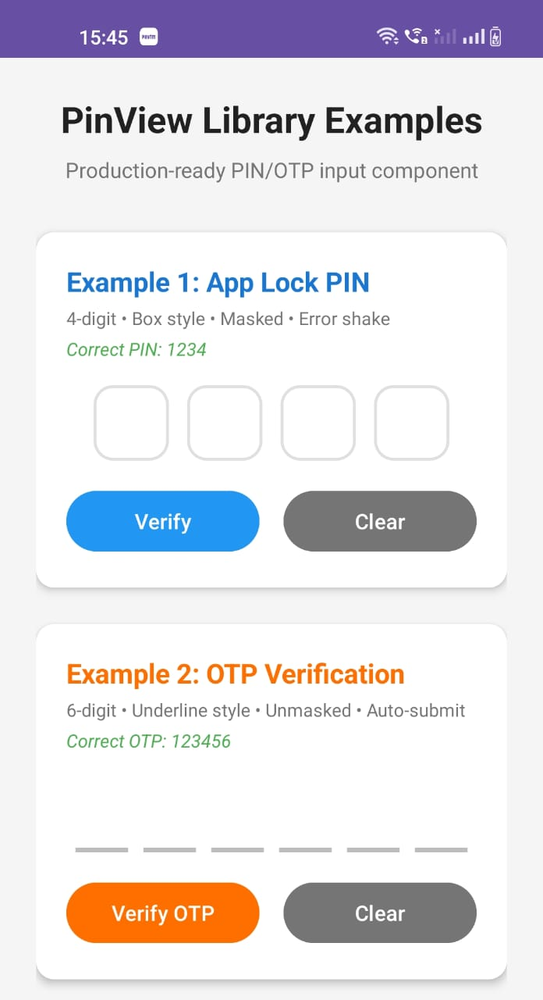
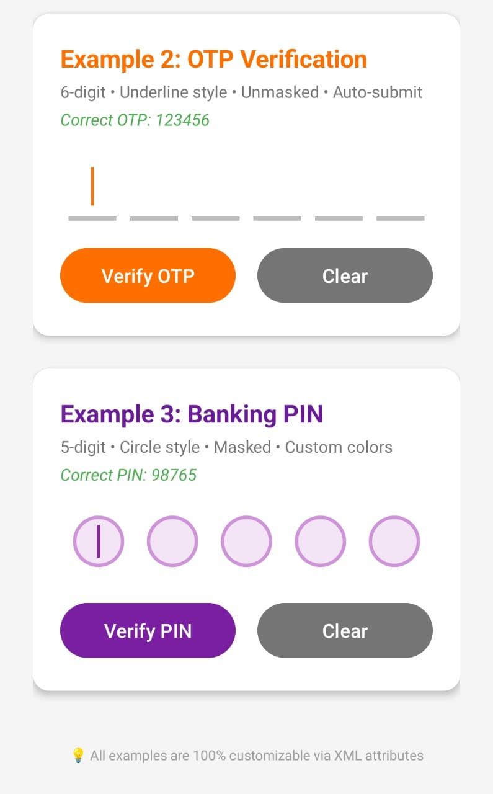

# Custom PinView Library for Android

[](https://kotlinlang.org)
[](LICENSE)
[](#)
[](https://jitpack.io/#Excelsior-Technologies-Community/Android_CustomPinView)

**Custom PinView Library** is a powerful, production-ready Android library that provides a highly customizable PIN/OTP input component. Perfect for app locks, two-factor authentication, banking apps, or any secure numeric code entry screen.

---

## 📸 Preview




---

## ✨ Features

- **Three Beautiful Styles**  
  - `BOX` – Classic bordered boxes with rounded corners  
  - `UNDERLINE` – Clean, modern underline style  
  - `CIRCLE` – Elegant circular indicators  

- **Fully Customizable via XML**  
  Colors (border, text, background, cursor), sizes, spacing, corner radius, fonts, and more  

- **Secure Input Handling**  
  - Optional character masking (●) with configurable delay  
  - Numeric-only keyboard  
  - Copy/paste disabled by default  

- **Smooth Animations**  
  - Scale animation on digit entry  
  - Blinking cursor  
  - Shake animation on error  

- **Smart Behavior**  
  - Auto-submit when complete  
  - Error state with optional auto-clear  
  - Real-time text change listener  

- **Developer-Friendly API**  
  - `onPinEnteredListener` – triggered when PIN is complete  
  - `onTextChangedListener` – live updates as user types  
  - Programmatic control: `setText()`, `clear()`, `showError()`  

- **Lightweight & Performant**  
  Uses Canvas drawing with optimized Paint reuse and minimal invalidations  

---

## 📦 Installation

**Step 1:** Add JitPack repository to your root `build.gradle`:

```gradle
allprojects {
    repositories {
        maven { url 'https://jitpack.io' }
    }
}
```

**Step 2:** Add dependency to your app module's `build.gradle`:

```gradle
dependencies {
       implementation 'com.github.Excelsior-Technologies-Community:Android_CustomPinView:1.0.0'
}
```

---

## 🚀 Usage

### PinView - XML Examples

```xml
<!-- Example 1: App Lock (4-digit, Box, Masked) -->
<com.ext.custom_pin_view.PinView
    android:id="@+id/pinViewAppLock"
    android:layout_width="wrap_content"
    android:layout_height="wrap_content"
    android:layout_gravity="center"
    app:pinLength="4"
    app:pinViewType="box"
    app:maskEnabled="true"
    app:maskDelay="300"
    app:cornerRadius="12dp"
    app:boxWidth="50dp"
    app:boxHeight="50dp"
    app:boxSpacing="12dp"
    app:textSize="24sp"
    app:cursorVisible="true"
    app:scaleAnimationEnabled="true"
    app:errorShakeEnabled="true" />

<!-- Example 2: OTP Verification (6-digit, Underline) -->
<com.ext.custom_pin_view.PinView
    android:id="@+id/pinViewOtp"
    android:layout_width="wrap_content"
    android:layout_height="wrap_content"
    android:layout_gravity="center"
    app:pinLength="6"
    app:pinViewType="underline"
    app:maskEnabled="false"
    app:autoSubmit="true"
    app:boxWidth="35dp"
    app:boxSpacing="10dp"
    app:borderWidth="3dp"
    app:textSize="20sp" />

<!-- Example 3: Banking PIN (5-digit, Circle) -->
<com.ext.custom_pin_view.PinView
    android:id="@+id/pinViewBank"
    android:layout_width="wrap_content"
    android:layout_height="wrap_content"
    android:layout_gravity="center"
    app:pinLength="5"
    app:pinViewType="circle"
    app:maskEnabled="true"
    app:maskDelay="500"
    app:filledTextColor="#6A1B9A"
    app:boxBackgroundColor="#F3E5F5" />
```

---

## 💻 Kotlin Programmatic Usage

```kotlin
val pinView = findViewById<PinView>(R.id.pinViewAppLock)

// Listeners
pinView.setOnPinEnteredListener { pin ->
    if (pin == "1234") {
        Toast.makeText(this, "Correct PIN!", Toast.LENGTH_SHORT).show()
        pinView.clear()
    } else {
        Toast.makeText(this, "Wrong PIN", Toast.LENGTH_SHORT).show()
        pinView.showError()
    }
}

pinView.setOnTextChangedListener { currentText ->
    // Update verify button state
    btnVerify.isEnabled = currentText.length == 4
}

// Public methods
pinView.setText("12")           // Pre-fill
pinView.clear()                 // Clear input
pinView.showError()             // Trigger error shake
pinView.getText()               // Returns current PIN as String
```

---

## 🔧 XML Attributes

| Attribute                  | Type         | Default       | Description                              |
|----------------------------|--------------|---------------|------------------------------------------|
| `pinLength`                | integer      | 4             | Number of digits                         |
| `pinViewType`              | enum         | box           | `box`, `circle`, `underline`             |
| `boxWidth` / `boxHeight`   | dimension    | 50dp          | Size of each digit box                   |
| `boxSpacing`               | dimension    | 12dp          | Space between boxes                      |
| `cornerRadius`             | dimension    | 8dp           | Corner radius (box style only)           |
| `borderWidth`              | dimension    | 2dp           | Border thickness                         |
| `normalBorderColor`        | color        | #CCCCCC       | Default border                           |
| `focusedBorderColor`       | color        | #2196F3       | Active/focused border                    |
| `filledBorderColor`        | color        | #4CAF50       | Border when digit filled                 |
| `errorBorderColor`         | color        | #F44336       | Border on error                          |
| `boxBackgroundColor`       | color        | white         | Background fill                          |
| `textColor`                | color        | black         | Digit text color                         |
| `filledTextColor`          | color        | black         | Text color when filled                   |
| `textSize`                 | dimension    | 20sp          | Digit text size                          |
| `cursorVisible`            | boolean      | true          | Show blinking cursor                     |
| `cursorColor`              | color        | #2196F3       | Cursor color                             |
| `cursorWidth` / `cursorHeight` | dimension | 2dp / 24dp    | Cursor dimensions                        |
| `maskEnabled`              | boolean      | false         | Mask digits after delay                  |
| `maskCharacter`            | string       | ●             | Masking character                        |
| `maskDelay`                | integer      | 500           | Delay in ms before masking               |
| `animationEnabled`         | boolean      | true          | Master animation switch                  |
| `scaleAnimationEnabled`    | boolean      | true          | Scale effect on typing                   |
| `errorShakeEnabled`        | boolean      | true          | Shake on error                           |
| `autoSubmit`               | boolean      | false         | Auto-trigger listener when full          |
| `clearOnError`             | boolean      | false         | Auto-clear after error                   |
| `secureInput`              | boolean      | true          | Disable copy/paste                       |
| `disabledAlpha`            | float        | 0.5           | Opacity when disabled                    |

---

## 📝 Public Methods

```kotlin
fun setOnPinEnteredListener(listener: (String) -> Unit)
fun setOnTextChangedListener(listener: (String) -> Unit)
fun getText(): String
fun setText(text: String)
fun clear()
fun showError()
fun requestFocusForInput()  // Manually show keyboard
```

---

## 📄 License

```
MIT License

Copyright (c) 2025 Excelsior Technologies

Permission is hereby granted, free of charge, to any person obtaining a copy
of this software and associated documentation files (the "Software"), to deal
in the Software without restriction, including without limitation the rights
to use, copy, modify, merge, publish, distribute, sublicense, and/or sell
copies of the Software, and to permit persons to whom the Software is
furnished to do so, subject to the following conditions:

The above copyright notice and this permission notice shall be included in all
copies or substantial portions of the Software.

THE SOFTWARE IS PROVIDED "AS IS", WITHOUT WARRANTY OF ANY KIND, EXPRESS OR
IMPLIED, INCLUDING BUT NOT LIMITED TO THE WARRANTIES OF MERCHANTABILITY,
FITNESS FOR A PARTICULAR PURPOSE AND NONINFRINGEMENT. IN NO EVENT SHALL THE
AUTHORS OR COPYRIGHT HOLDERS BE LIABLE FOR ANY CLAIM, DAMAGES OR OTHER
LIABILITY, WHETHER IN AN ACTION OF CONTRACT, TORT OR OTHERWISE, ARISING FROM,
OUT OF OR IN CONNECTION WITH THE SOFTWARE OR THE USE OR OTHER DEALINGS IN THE
SOFTWARE.
```

---
